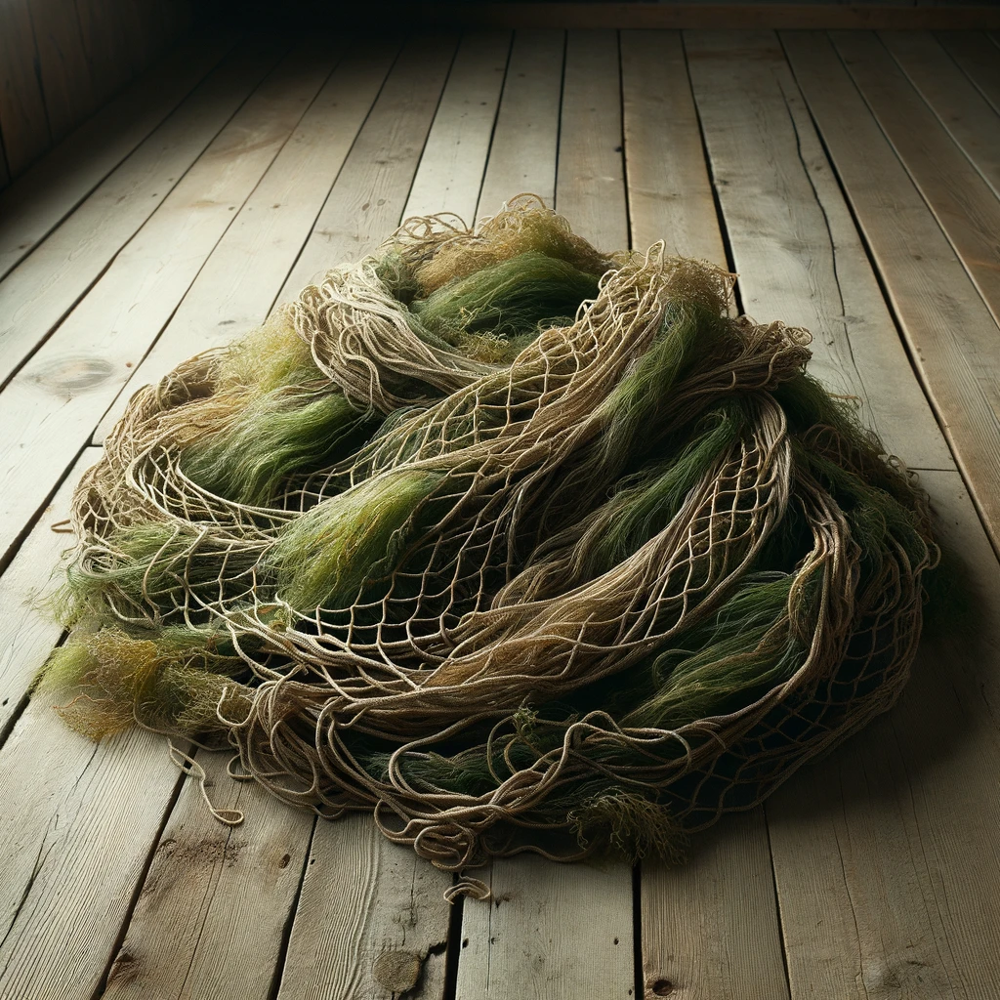

# About Me

 

I am Asheris Starglade, a Wood Elf hailing from a secluded woodland community near Haling Cove, my families legacy is deeply intertwined with the [Sylvan Sentinels](#sylvan-sentinels), a revered group responsible for safeguarding the forest surrounding [Haling Cove](#haling-cove), the thriving city on the bay. However, despite my family's heritage, I have chosen a different path for myself.

Growing up in the woods, I developed a strong affinity for nature and a profound connection with the forest's creatures. As I reached adulthood, a sense of wanderlust and curiosity about the wider world drove me to embark on my own journey rather than following in the footsteps of my family. I sought to deepen my understanding of the diverse cultures and forge their own path as a Twilight Cleric, drawing upon the celestial gift they received in the hidden glade.

Despite not joining the ranks of the [Sylvan Sentinels](#sylvan-sentinels), I remain deeply committed to the protection of the forest and the harmony between the city and the natural world. I strive to use my divine powers to heal, guide, and bring balance wherever I go.

?> Asheris Starglade on DND Beyond: https://www.dndbeyond.com/characters/102399990

## Information

| Characteristic  | Value                                                      |
|:----------------|------------------------------------------------------------|
| **Race**        | Elf                                                        |
| **Class**       | Cleric                    s                                 |
| **Armor Class** | 12                                                         |
| **Hit Points**  | 15                                                         |
| **Speed**       | 35 ft. *(Fleet of Foot)*                                   |
| **Senses**      | darkvision 300 ft *(Eyes of Night)*, passive Perception 14 |
| **Languages**   | Common, Dwarvish, Elvish, Sylvan                           |
| **Level**       | 3                                                          |

---

|  STR  |  DEX  |  CON  |  INT  |  WIS  |  CHA  |
|:-----:|:-----:|:-----:|:-----:|:-----:|:-----:|
|10 (+0)|12 (+1)|12 (+1)|14 (+2)|15 (+2)|13 (+1)|

## Adventurers

### Aleric Mysticmind Stoneweaver

### D3PUTY

### Kuran

### Lucy

---

# Adventure

## Chapter 1 - Willdale and the Cloakwood
*Play Date: June 20, 2023*

### On the Road

*My entires for today are not complete as this page of the journal got wet in my travels. - Ash*
:
We received a letter from a courier with a request for us to find [Talia](#talia) about a job. Gold these days has been getting short. So we figured the short walk was worth while. Travels to [Willdale](#willdale) are usually uneventful.

### Town Center

Our arrival in [Willdale](#willdale) was marked with a sense of unfamiliarity and uncertainty. We were adrift in purpose, unsure of where to find [Talia](#talia) or where our next steps should lead us. In response, our party decided to split up, hoping to cover more ground and gather information. [Lucy](#lucy) and I ventured through the town, engaging with the locals. Lucy, ever so fervently, attempted to recruit more followers for The Fiend, her devotion unwavering.

<figcaption><b>The Town of Willdale</b></figcaption>

As we meandered through the town, our journey eventually led us to the Inn - a hub of Willdale's daily life and stories. The Inn was bustling, a mosaic of people and conversations. In the midst of this lively atmosphere, something unexpected occurred. Lucy, with her uniquely deft hands and a knack for trouble, managed to rob the tavern owner. The details of how this transpired were a blur, a swift and sly act that even I could barely keep track of.

The situation escalated quickly, and before we could fully grasp the repercussions of Lucy's actions, we found ourselves fleeing towards the edge of town. The need for a hasty retreat was clear - staying would have only invited trouble and risked the entire party's safety. So, under the cloak of urgency and secrecy, we made our escape, the image of Willdale fading behind us as we moved swiftly into the embrace of the unknown.

---

## Chapter 2 - The Spider
*Play Date: June 27, 2023*

### Middle of the Night

I was awoken in the middle of the night from my resting state. I heard a noise from the darkness ahead but couldn't quite place it. The rest of my adventurers appeared to be sleeping, having rushed from town the evening before. The ash's from the nights fire barely glowing. 

Suddenly a sticky web pinned me to a tree, I couldn't move at all. I looked out into the darkness, even with my keen eyesight, I was unable to see what is trapping me, or who attacked us. While [D3PUTY](#d3puty) looks out into the distance I wake up [Kuran](#kuran). Neither of them are able to see the monster either. We awaken the rest of the team.

I think in an attempt to bring light to the darkness, [Kuran](#kuran) lights a bolt of cloth on fire. Illuminating the area around us, but the foe remained cloaked in darkness. [Aleric](#aleric-mysticmind-stoneweaver) attempted to scare the monster with his *Hideous Laughter* but was unable to conjure the spell in his sleepy mental fog.

I am eventually able to break free from the sticky web after [Lucy](#lucy) ignites the tree I am trapped against on fire. But not before the team is struck with booming thunder from the skies ([Aleric](#aleric-mysticmind-stoneweaver) really needs to wake up!)

A giant armored spider finally makes it appearance by pouncing on [Aleric](#aleric-mysticmind-stoneweaver) -- pinning him to the ground! I attempted to attack the beast. Conjuring up my [Guiding Bolt](#guiding-bolt) but am unable to work it. (I really need to practice more).

With this failure, [D3PUTY](#d3puty) pulls his longbow (from where, I have no idea), and fires against the best. It collapses, defeated.

### The Grove and Meeting Talia

With the morning sun starting to rise I heard footsteps coming from the distance. An Elf and Dwarf approach. The Elf introduced herself as [Talia](#talia). Her and her dwarven comrades bring us to their camp in the north-east of [Willdale](#willdale).

The camp is made up of a handful of wooden cabins scattered about a small field -- [The Cloakwood](#the-cloakwood) surrounding it. I did notice a familiar tower near the edge of camp. Though I can't quite place it.

[D3PUTY](#d3puty) has discovered what [Talia](#talia) may want us for: he discovered that [Talia](#talia) has been doing some extensive research into the Fey of the [Cloakwood](#the-cloakwood).

We met [Talia](#talia) outside. She informed us we have been hired to determine why the [Brownies](#the-brownies) have been attacking the towns folk and loggers.

[D3PUTY](#d3puty) pulled from his knowledge-base that this is very unusual behavior for [Brownies](#the-brownies), they are typically "insisted", simple minded, and there are for scarier things in [The Cloakwood](#the-cloakwood) than dwarves.
: 
[Talia](#talia) has provided us direction, and we set out.

---

## Chapter 3 - The Grove

*Play Date: July 11, 2023*

### Discovering the Cloakwood

We embarked on a path known to be tread by the Brownies in and through the [Cloakwood](#the-cloakwood), diminutive creatures standing no taller than four feet. We moved through the forest, guided by the gaps in the trees, where the sunlight streamed through to light our way.

My mind drifted back to old stories and knowledge: the Brownies, typically solitary creatures, with no central leadership to speak of. They set up camps in various locations, drawn to the beauty of the world and the promise of ample sustenance. They often steer clear of humanoids, choosing to dwell in peace. Tales speak of Sylvans driven out of their towers - a disturbing anecdote of the times we live in. Their language is a mixture of Sylvan, Halfling, and at times, Common. 

[Kuran](#kuran) attempted to get a better view of our surroundings by scaling a towering tree but was unable to spot anything significant.

As the forest path narrowed, we made a strategic decision to split up - [D3PUTY](#d3puty) and [Aleric](#aleric-mysticmind-stoneweaver) ventured east, while [Kuran](#kuran) and I headed south. The path underfoot was well-trodden and quiet, the silence only punctuated by the sounds of wildlife in the distance.

Eventually, those who headed east found themselves in a clearing, a vast opening in the otherwise dense woodland. I look forward to reuniting with them soon and sharing what we have discovered in our respective journeys.

### The Tent

> **Account of Aleric, D3PUTY, and Kuran**
>
> The group had found themselves in a serene setting—a small pond adjacent to a towering boulder. Kuran had taken the initiative to explore the area in search of signs of the elusive Brownies, while Aleric and D3PUTY observed with anticipation. The tranquil atmosphere and the air of mystery that surrounded the scene piqued his curiosity.

As I stealthily made my way through the eastern forest, I skillfully maneuvered around the worn and disheveled camp in the distance. My goal was clear: reach the trail that led northward to meet up with [Aleric](#aleric-mysticmind-stoneweaver), [Kuran](#kuran), and [D3PUTY](#d3puty). I knew the importance of maintaining a safe distance from the tent, so I focused on staying hidden as I moved through the undergrowth.

Every step I took was deliberate, ensuring I made no unnecessary noise that could give away my presence. The forest seemed to offer its guidance, revealing hidden paths that led me closer to my companions. I remained vigilant, scanning my surroundings for any signs of danger or potential obstacles.

Navigating through the dense foliage, I followed the concealed trail with determination. I carefully evaded any traces of detection, my instincts guiding me towards the rendezvous point. Finally, I emerged from the forest, relieved to see the familiar faces of [Aleric](#aleric-mysticmind-stoneweaver), [Kuran](#kuran), and [D3PUTY](#d3puty) waiting for me.

With a sense of accomplishment, I explained my decision to bypass the worn and disheveled camp, focusing instead on our shared journey and the mysteries that awaited us. 

### Fudh and Goim

We headed south towards the tent and [Kuran](#kuran) and I skillfully approached the worn and disheveled tent, our curiosity pushed us to investigate further. [Kuran](#kuran) quietly peeked inside, revealing a surprising scene of Brownies engrossed in sticks and dice games. Among them, two stood out—one with a brown hat and the other with a distinctive red hat.

To our astonishment, the Brownie with the red hat noticed Kuran's presence and eagerly divulged details about their camp. He mentioned that their leader, known as [Grum](#grum), was waiting for us. Intrigued, [Aleric](#aleric-mysticmind-stoneweaver) joined our conversation, observing that the Brownie with the red hat seemed a little peculiar, smirking and hinting at the mysterious nature of meeting Grum.

They introduce themselves as [Fudh](#fudh) and [Goim](#goim).

However, it was [the Brownie](#the-brownies) wearing the brown hat who seized the opportunity. He cunningly offered to exchange our gold for a chance to meet Grum and be guided to their camp. With a slight hesitation, we relinquished the gold, intrigued by the prospect of discovering more about these enigmatic Brownies and their elusive leader.

### To the Camp

As [Aleric](#aleric-mysticmind-stoneweaver) and [Kuran](#kuran) trailed the Brownies towards their camp, [D3PUTY](#d3puty) quietly followed Kuran's lead, while I stealthily sneaked alongside, remaining unnoticed by the rest of the party. Little did we know that [Grum](#grum), the leader of the Brownies, would turn out to be an unusually large and fat Boggle, a rare sight given their usual small stature.

Seizing the opportunity, I crept up behind [Grum](#grum) and the Brownies in their camp, equipped with sleeping mushroom spores harvested from the mushrooms growing on my shoulders. With a swift application, I put three of the Brownies to sleep, leaving the remaining ones trembling in fear as they fled. The group, sensing an advantage, launched an attack on Grum.

I took the initiative and employed a necrotic mushroom, inflicting severe damage akin to an acid burn onto Grum's shoulder. Our combined efforts proved successful as we fought valiantly, taking on the formidable Boggle. The encounter was intense and full of surprises, as our party faced a foe larger and more dangerous than expected.

In the midst of the chaotic battle, [Aleric's](#aleric-mysticmind-stoneweaver) attempt to cast hideous laughter on [Grum](#grum) backfires, leaving him laughing uncontrollably. [Kuran's](#kuran) attack misses its mark, and [Grum](#grum), displaying an unexpected ability, becomes shiny and oily, reappearing on the other side of the field. [D3PUTY's](#d3puty) attempt with the longbow also fails, as does my own with the crossbow.

Determined to subdue [Grum](#grum), [Kuran](#kuran) fiercely strikes him while he tries to escape. [Grum](#grum), displaying his teleportation ability, surprises us by suddenly appearing behind me. [Aleric](#aleric-mysticmind-stoneweaver), moving with surprising swiftness, pommels Grum with a dagger, rendering him unconscious.

As I survey the remaining Brownies, [Kuran](#kuran) shouts, "Are you not amused?" After [Kuran's](#kuran) taunting words echo through the clearing, the remaining Brownies are visibly frightened. The unexpected display of power from our group and the defeat of their leader, Grum, have left them no choice but to scatter in all directions. Their tiny figures disappear into the foliage, escaping into the safety of the forest.

As the dust settles, the once lively camp now lies in silence, only the rustling of leaves and the occasional hoot of an owl filling the air. We gather ourselves, ensuring that [Grum](#grum) is securely fastened to [D3PUTY's](#d3puty) back. Despite the intensity of the battle, a sense of relief washes over us. We've achieved our goal, but our journey is far from over.

With a collective understanding, we decide to make our way back, carrying Grum with us. The forest slowly envelopes us once more as we walk through the undergrowth, retracing our steps to return to the place where it all began.

### Night Settles In

Settled within the confines of [Grum](#grum)'s dim-lit camp, I'm kept awake by the hum of activity around me. [Lucy](#lucy) saunters in, eliciting laughter and amusement from the group as she recounts her latest adventure - an audacious feat involving selling her pilfered trousers from her days in Willdale. Her knack for light-hearted trouble seems to have an almost magical way of lifting our spirits (well, for most of us at least).

Having made the decision to overnight in [Grum](#grum)'s thatched shelter, I can hear [D3PUTY](#d3puty) and [Lucy](#lucy) engaged in earnest conversation just beyond the entrance. Their words - questions of reality and meaning - drift in and out of my hearing.

From my place of quiet observation, I watch as [D3PUTY](#d3puty) scrutinizes [Grum](#grum) with a hardened gaze. He senses a potent, malevolent magic surrounding [Grum](#grum), a force that carries echoes of the Feywild or perhaps the Shadowfell. The air seems to thicken with intrigue and uncertainty as [Grum](#grum) holds us within his enigmatic grip.

[Lucy](#lucy), guided by her instinctual acumen for the arcane, tries to discern the nature of [Grum](#grum)'s divine patron. She appears to determine that [Grum](#grum) is a being displaced from another plane, deepening the shroud of mystery that wraps around this curious Boggle.

As the hours stretch on, I remain ever-watchful, my senses attuned to the sounds and movements that fill the night. The campfire casts dancing shadows across the faces of my companions, its crackling chorus a soothing lullaby against the backdrop of hushed voices. In my state of restful alertness, I bear witness to the stories spun, the revelations uncovered, and the riddles posed - each deepening the complexity of our enthralling journey.

---

## Chapter 4 - Returning to Willdale

*Play Date: July 18, 2023*

### Leaving the Brownie Camp

We, as a group, had been preparing to depart from the camp when our path crossed with that of a unique creature, a Brownie named [Alarin](#alarin), donned in an eye-catching purple hat. She was returning from her ventures in the forest, her wary eyes telling stories untold.

Her fear was tangible in the cool air, an emotion I aimed to assuage temporarily using the soporific spores of my magical shoulder mushrooms, their mystical properties sending her into a deep slumber. In her vulnerable state, [Kuran](#kuran) conducted an intrusive yet necessary search, a necessity that never ceases to unsettle me.

Upon awakening, [Alarin](#alarin) was met with the calming demeanor of [Aleric](#aleric-mysticmind-stoneweaver), his soothing words breaking through her initial trepidation. In the midst of this, [Lucy](#lucy), seizing an opportunity with an impish grin, absconded with Alarin's purple hat.

[Alarin](#alarin)'s attempts at escaping bore no fruit, her fear driving her actions. She revealed tales of a certain Grum, a creature who ruled over the Brownies through fear. Lucy, relentless in her pursuit of knowledge, pressed Alarin for more information. To underscore our intent, I channeled my Thaumaturgy, amplifying Lucy's voice until it echoed ominously throughout the quiet forest. Alarin relented, marking on our map of the Cloakwood forest where others of her kind could be found.

With our newly acquired knowledge, we made the collective decision to return to the lumber camp, hopeful to find Talia. As I sit here under the canopy of twilight, our recent encounters weigh on my mind. The balance of our world remains delicate, yet I am hopeful. Standing united with my companions, I trust that we can guide those burdened by fear towards the dawn's light. 

### Back at the Lumber Camp

We returned to the lumber camp in [Willdale](#willdale) and reunited with [Talia](#talia). As we gathered around her cabin, I observed the curious sight of [Grum](#grum), the boggle, perched on [D3PUTY](#d3puty)'s back. The encounter with the boggle had left us with many questions, and we eagerly reported to [Talia](#talia) about the dark fey magic we had encountered surrounding [Grum](#grum).

[Talia](#talia) took a keen interest in [Grum](#grum) and inspected him closely. I couldn't help but notice the oozing and deteriorating state of [Grum](#grum)'s arm, a result of the necrotic damage I had inflicted during our intense battle with him. [Talia](#talia)'s initial impulse was to shoot and kill [Grum](#grum), but [D3PUTY](#d3puty) intervened, preventing her from taking drastic action.

In an unexpected turn of events, [Grum](#grum) suddenly blinked or teleported away while [Lucy](#lucy) tried to charm him for more information about his origin. [Kuran](#kuran) attempted to shoot him with his bow, but the arrow missed its mark.

Despite the chaotic encounter, [Talia](#talia) expressed her gratitude, rewarding us for successfully stopping [Grum](#grum). She seemed pleased that we had managed to do so without harming the Brownies in the process.

[Talia](#talia) now seeks to introduce us to her master, [Sæsephyr](#sæsephyr). Intrigued by the opportunity, we follow [Talia](#talia) as she leads us to a point on the coast, where a small cabin and pier await. The mysteries of this journey continue to unfold, and I am eager to see what awaits us in the presence of [Sæsephyr](#sæsephyr) and the adventures that lie ahead.

### Sæsephyr

Our journey led us to the pier, where [Talia](#talia) guided us to meet [Sæsephyr](#sæsephyr). As we approached, a heavy air filled the surroundings, as if foretelling an impending storm.

Then, from the depths of the water, a mesmerizing sight appeared—a scaly and shimmery figure materialized, revealing an enormous dragon—an ancient mist dragon. Its presence was awe-inspiring, and although I had heard stories of such beings in these lands, I had never laid eyes on one before.

The dragon, whom [Talia](#talia) addressed as [Sæsephyr](#sæsephyr), seemed to have some familiarity with me, though I couldn't quite place it. Tales of an ancient mist dragon named [Sæsephyr](#sæsephyr) had circulated, and I now found myself standing before this enigmatic creature.

Aleric's unease was evident, and Kuran shared the same sentiments. Their caution was well-founded in the presence of such an imposing being.

[Sæsephyr](#sæsephyr) spoke with wisdom and urgency, revealing a long-forgotten tale of two wizards seeking ancient magical artifacts near the town of Haling Cove. The fate of these artifacts and the surrounding realms rested on their decisions. The demise of the wizards—Archmage [Roberto](#roberto) and the ambitious [Belven](#belvin)—remained shrouded in mystery, with the ominous presence of The [Sæsha'sol](#the-sæshasol) (The Sea Gloom) casting shadows over their fate.

The dragon entrusted us with a crucial task—to journey to Haling Cove and uncover the lost artifacts. A daunting responsibility, one that [Sæsephyr](#sæsephyr) himself refrained from taking due to the attention it might draw.

As a sign of his trust, [Sæsephyr](#sæsephyr) offered us magical tools from the cabin by the pier, essential for our upcoming quest.

> “Travelers, I have asked Talia to seek you out, because I believe you have the best chance to succeed. Long ago, two wizards sought out ancient magical artifacts, near the town of [Haling Cove](#haling-cove-1). Archmage [Roberto](#roberto) believed he could unravel their secrets and took with him a delegation to take the artifacts somewhere they could be kept safe and studied, whereas the younger, more ambitious Wizard [Belven](#belvin) wanted to study them for himself, and knew as soon as they were in Roberto’s vaults they’d be out of his reach.
> 
> “As Roberto prepared to take an artifact from the oceans, he was found murdered on the docks. Some suspected Belven, but the town of Haling Cove sided with Belven - they found him charming, and he planned to retrieve the tablet for himself.
> 
> A few months later, Belven was also found dead, his back full of tiny spears - likely the work of the [The Sæsha'sol](#the-sæshasol) (The Sea Gloom). It’s uncertain whether he found and retrieved any of the artifacts or not.
> 
> Go to Haling Cove and find the artifacts. The fate of [the Cloakwood](#the-cloakwood-1), the [Sea of Swords](#sea-of-swords), and perhaps even Faerun itself hangs in the balance. I would do this task myself, but fear I would draw far too much attention to things that are best left quiet.
> 
> The presence of your Boggle suggests that the situation is worsening, and we can no longer simply watch.

Our meeting with [Sæsephyr](#Sæsephyr) bore important counsel - the Sea of Swords is treacherous and best avoided, we were advised to stick to land routes. Retrieving the artifacts ourselves was deemed the prudent choice, for if [Sæsephyr](#Sæsephyr) were to attempt, it might draw an undesirable amount of attention. However, [Sæsephyr](#Sæsephyr)'s promise of assistance should we need and call for it was reassuring.

Even as we discussed our plans, [Lucy](#lucy) showed her carefree spirit, leaping into the water from the pier, swimming lazily, revelling in the moment. Meanwhile, [Aleric](#aleric-mysticmind-stoneweaver) sought to understand the relationship between Talia and [Sæsephyr](#Sæsephyr), learning that Talia served as [Sæsephyr](#Sæsephyr)'s emissary in dealing with others.

The mention of Haling Cove stirred my memory - a story from my childhood about two wizards, Belvin and Roberto. As a child, I had lived through their time, their tales now a part of history and lore.

Our journey brought us past a fascinating fountain near the pier as we made our way to the cabin for supplies. [D3PUTY](#d3puty) examined the fountain, noticing runes inscribed along its side. Despite [Aleric](#aleric-mysticmind-stoneweaver)'s assistance, the nature of the runes eluded us, though we recognized the fountain as a potential source of mana.

In a playful jest, [Lucy](#lucy) dared us to drink the water, and before [Aleric](#aleric-mysticmind-stoneweaver) could even respond, Talia scooped up a handful of the fountain's water and drank, a demonstration of faith in the unknown.

 

#### Small Vial of Mana:

These small vials of mana provide many benefits: Drink before a spell to add 2 to the consumers spell casting modifier or roll a <kbd>1D20</kbd>, if 11 or greater, restore a spell slot.

### The Cabin

Upon entering the cabin, we discovered an array of wondrous and mysterious objects on display:

---

#### Shark Tooth Dagger

With teeth running down both sides, promised advantage against aquatic foes. 

#### Enchanted Snail Shell

Functioning as a magical courier, allowing the holder to cast 'Sending' once per day. *- Ash took this!*

#### Ancient Mariner's Armor

Weathered by the sea, bristled with barnacles but promised enhanced swimming speed and resistance against being knocked prone.

#### Driftwood Trident

Interlaced with bits of coral, held the power to dominate aquatic creatures. 

#### Magical Net

Net of snaring had the capability to trap enemies and could adjust its size to accommodate any creature up to large size. 

#### Manta Mask

The mantle of a manta ray, heavy and imposing, granted underwater breathing and increased swimming speed.

#### Glowing Pearl

A softly glowing pearl could replenish a spell slot up to third level once per day. 

#### Glass Orb

A glass orb, recognized as a drift globe, radiated a daylight spell with a 60-foot radius once per day. 

#### Barnacled Harp

Crafted by the merfolk, could inspire allies with bardic inspiration once per day when played.

#### Coral Staff

* A coral staff functioned as a spellcasting focus and allowed its bearer to control water once per day. 

#### Luminous Compass

A magical compass, [D3PUTY](#d3puty) identified the luminous compass as the handiwork of the Gyrewalkers - a nomadic group known for their advanced technology.

#### Bronze Timepiece

Has the power to cast haste for one minute once every 24 hours piqued my interest, and I decided to claim it.

Amidst our fascination and mild bickering over the remaining items, we took our leave, each filling a small vial with mana from the cabin.

---

## Chapter 5 - To Haling Cove

*Play Date: July 25, 2023*

### Headed Home

>*Looking back, my time spent in Haling Cove floods my mind with vibrant recollections. The idyllic bay city, draped in a harmony of nature and civilization, always felt like a second home. The Sylvan Sentinels, my family, maintained a vigil over the encompassing forest, ensuring the city's tranquility. As a child, I would often lose myself in the labyrinth of marketplaces, drawn to the symphony of bustling life, the scent of spices, and the sight of numerous wares from far-off lands. I remember the wizards, Belvin and Roberto, their stories of magic and wonder resonating deep within me. Despite not being a part of the Sentinels myself, Haling Cove still shaped me, its influence running as deep as the roots of the forest that guards it.*

### Centaurs

We resolved to enter Haling Cove under the cover of night, a decision accompanied by a shroud of uncertainty. Our journey began on a well-trodden path between [Willdale](#willdale) and [Haling Cove](#haling-cove), under the vast, twinkling canvas of the evening sky.

As we traveled, the rustling sounds of approach reached our ears. Drawing on my elven instincts, I melted into the shadows of the trees flanking our path. To our surprise, we were greeted by the sight of a pair of centaurs moving gracefully down the road. [Lucy](#lucy), ever the impulsive one, emerged in front of the majestic creatures, creating a momentary standstill.

[D3PUTY](#d3puty), in his typical observant manner, whispered to us that these centaurs, bathed in an ethereal bioluminescent glow, were likely members of the [Shadowglow Clan](#shadowglow-clan), and generally friendly. As Lucy attempted to explain our connection with [Sæsephyr](#Sæsephyr) the dragon, [Aleric](#aleric-mysticmind-stoneweaver) swiftly intervened, spinning a tale that Sæsephyr was merely a moniker, not an actual dragon. Astonishingly, the centaurs bought into the lie.

Providing us with invaluable information, they confirmed the route to Haling Cove should be unobstructed. However, they warned us to steer clear of the beaches, citing unusual creatures lurking along the coast. Their words, laced with caution, added an edge to my already wary spirits.

Deciding to err on the side of caution, we trailed the centaurs from a safe distance until the silhouette of Haling Cove began to take shape through the darkened trees. 

### Familiar Woods

We arrived at the outskirts of Haling Cove as the sun began to surrender to the encroaching darkness. Our path led us to a somber clearing that stirred a chilling memory from my childhood. I found myself drawn to it, my heart sinking as the realization of what lay beneath the surface dawned on me. 

This was a mass grave, a grim testament to the days when a flood of sick refugees sought sanctuary within Haling Cove's walls, only to be denied entry. The memory of the refugees' fate, dying en masse virtually overnight, still bore heavy on my heart. They were buried here, far from the safety and warmth of their homes, their lives reduced to untended mounds of earth. 

[D3PUTY](#d3puty) tried to dredge up any memories of Haling Cove, but to no avail. The city, it seemed, was buried under layers of forgotten memories, much like the refugees under the soil.

Peering into the gathering dusk, I sought signs of the [Sylvan Sentinels](#sylvan-sentinels) in the treeline, but the forest stood silent and still. However, the path stretching towards the right was a familiar sight. I remembered it being a bustling route leading to the town, often teeming with foot traffic. 

To the left lay another path, one that diverged towards an old mining camp. The choice ahead of us was clear - venture into the heart of Haling Cove or explore the forgotten remnants of the mining camp. 

### Short Rest in the Abandoned Mining Camp

Having decided to rest for the night, we found a suitable spot in an abandoned camp close by. While we settled, [Lucy](#lucy) took it upon herself to scout the area, perusing the remnants of the camp's past life. She returned with an assortment of discarded objects - a pair of antlers, some skins - tangible traces of those who had once inhabited these tents.

To our north, a dormant mine sprawled out, its entrance yawning open like a mouth in the earth. Rusting, forgotten equipment hinted at its past hustle and bustle. [D3PUTY](#d3puty), meanwhile, peered into the forests' shadows, seemingly drawn in by an inexplicable presence. He was confident he sensed the Fae and even speculated about spotting a Sylvan tower amid the foliage. 

[Lucy](#lucy) then brandished the map we'd received from the Brownies. According to her interpretation, part of the map suggested a section of the nearby forest. It also marked a Brownie settlement within what seemed to be a manageable distance from our current location.

As we hunkered down for the night, the thought of what the new dawn would bring hung heavily in the air.

### Haling Cliffs

After a brief respite, our party decided to push on towards the town. We chose to stick to the cover of the woods for our approach, all except [Aleric](#aleric-mysticmind-stoneweaver) who preferred to follow the road. [D3PUTY](#d3puty) and I successfully scaled the cliff-side near the mine's opening, though [Kuran](#kuran) and [Lucy](#lucy) weren't as fortunate, their attempts ending in a tumble. As [Aleric](#aleric-mysticmind-stoneweaver) set off on his own, he employed [Lucy](#lucy)'s drift orb to light his way, prompting [Lucy](#lucy) to chase after him and join him on the road.

Meanwhile, I tied a rope around [D3PUTY](#d3puty) and helped [Kuran](#kuran) up the cliff. Once reunited, we pressed on, under the cloak of the woods. [Aleric](#aleric-mysticmind-stoneweaver), now accompanied by [Lucy](#lucy), continued along the road, peering into the darkness of the forest but seeing little.

While moving through the heavy woods, [Kuran](#kuran) managed to discern the outline of a heavily overgrown guard tower in the forest. The tower, nearly consumed by creeping vines and interlacing branches, appeared to have several rooms formed within and around it, their windows glowing faintly with light.

<figcaption><b>Sylvan Tower</b></figcaption>

Recognizing this as an old Sylvan sentinel tower, I approached cautiously, finding evidence of Brownie inhabitants. Choosing to introduce ourselves as friends of [Fudh](#fudh) and [Goim](#goim) (an unabashed falsehood), we managed to gain a skeptical audience with the Brownie woman who answered the door.

In exchange for a modest offering of gold, we were served small cups of frothy liquid by a pair of Brownies, and our hostess stoked the fire in a welcoming gesture, throwing a burning log into the fireplace.

### Strangers in Haling Cove

As dusk cloaks the surrounding in a dim veil, [Aleric](#aleric-mysticmind-stoneweaver) and [Lucy](#lucy) part ways with us, opting for the defined trail leading to the town instead of scaling the cliffs with the rest of us. Aleric, seemingly engrossed in his own soliloquy, doesn’t notice when Lucy, with her knack for stealth, dissipates into the shadows behind him. He merely shrugs and continues his self-absorbed discourse.

Upon nearing the town, the sounds of his monologue are intersected by a voice echoing through the nightly stillness, originating from the outskirts of the town. The silhouette of a woman materializes, a hand on her hilt, her voice a blend of caution and intrigue. She is vigilant, questioning Aleric’s lone nocturnal roam. Aleric, weaving a tapestry of partial truths, tries to sway her suspicions but the strands of his story don’t interlace convincingly. He mentions Lucy’s sudden departure, but the woman’s eyes, bathed in skepticism, probe deeper. She is resolute, calling his bluff yet again. Eventually, Aleric peels off layers of deception, revealing partial truths about our party, careful not to divulge the core of our venture. The tense grip around her hilt loosens, a semblance of trust dawning in her demeanor. She introduces herself as Corrine, the sheriff of the town, whose authority seems to be wavering in these times. Corrine, a human appearing in her mid-30s, bears a roughened visage with a mohawk and an eye patch cloaking her right eye. Despite her badge and rugged appearance, she doesn’t seem fully armored.

The scene transitions back to [Ash](#ash), [D3PUTY](#d3puty), and [Kuran](#kuran). Our inquiries about Belvin and Roberto find echoes in the Brownies’ tales. It appears they might have crossed paths with these individuals. However, the Brownies admit to avoiding the town, preferring the unseen paths when necessity drives them there. We leave the Brownies, our pockets lighter but our hearts warmed by their hospitality, and make our way to the town, hoping to reunite with Aleric and Lucy. 

Ash’s memory paints images of an inn/pub nestled amongst the downtown shops, a probable refuge for our separated companions. Our paths converge again in the town, the familiar faces of our comrades blending with the tapestry of the inn’s patrons—a handful of humans, a dwarf, and a half-elf, immersed in their own worlds. Our requests for rooms are met with nods from the barkeep, and we settle in, our minds a whirlpool of thoughts and plans.

## Chapter 6 - The Nightwatch

*Play Date: August 1, 2023*

### The Inn, Shadows of Disfavor 

The warmth of the Honeywell Tavern welcomed us. [Matilda](#matilda): was busy behind the counter, skillfully pouring mugs of Honeywell mead and arranging plates of the most delectable dishes. I've heard stories of their famous honeyed pear tart, and it did not disappoint.

While my palate indulged in rich flavors, [Aleric](#aleric-mysticmind-stoneweaver): seemed magnetically drawn to the fiery essence of hot spices, with a peculiar inclination for fried seaweed crisps. Matilda: was all too happy to cater to this adventurous craving.

In a lull, [Aleric](#aleric-mysticmind-stoneweaver): engaged the locals, unraveling stories and legends. My own attention was caught by a bulletin board. Among the various postings, a wanted poster with an unrecognizable centaur-like figure piqued my interest. What truly caught my eye, however, was the dominating Night Watch recruitment note, so strategically placed that it obscured an older notice about the sheriff.

As I pieced together the snippets of town news, [Aleric](#aleric-mysticmind-stoneweaver) beckoned me over, rambling something about his insatiable thirst for spice. I decided to gift (or possibly a test) of one of my lesser spicy shoulder sprouts. The little thing sent him crashing to the floor! Clearly, we had underestimated its potency. *The [Pyroshroom Blazehole](#pyroshroom-blazecap) is not to be trifled with.*

In the midst of the commotion, Aleric: had gained some information about the [Nightwatch](#the-nightwatch). Pointed in the direction of two imposing figures, one particularly bearded, he approached with that characteristic 'non-threatening old man' demeanor. Their interaction was... memorable. "Magic folk don't make good guards," the bearded one mused aloud. Wanting to make a point, a quick thaumaturgy spell from me didn't go unnoticed, and instead of being impressed, the men - from the Nightwatch, it turns out - were quite irritated. Before we knew it, we were summoned to meet with the Nightwatch.
:
Matilda: later revealed that these men were [Commander Roy Medeza](#commander-roy-medeza) and [Terry Thrampton](#terry-thrampton). The name Thrampton... it jogged my memory. The Thramptons were integral to Haling Cove's history. I remembered tales of Peter Thrampton's disappearance, intertwined with matrimonial alliances and familial legacies. And, as I pondered, I recalled the somber echoes of the Quiet Year, a significant event from some 20-25 years ago. It was during my time here, and its shadow still lingers in the town's psyche.

### A Night to NOT Remember

The late-night shroud of Haling Cove's docks seemed like the perfect cloak for my quest for information. Under the cover of darkness, the docks whispered with the secrets of the sea, secrets I hoped to uncover. However, the night had other, less favorable plans for me.

Just as the moon reached its zenith, casting eerie shadows over the creaking docks, the sound of heavy, methodical steps shattered the nocturnal peace. The Nightwatch, ever vigilant, emerged like specters from the darkness. My attempts to dissolve into the night's embrace were futile against their watchful eyes.

Questions came like arrows in the night, sharp and unyielding. My words, carefully chosen, seemed to dissipate into the cold air, unheard, unbelieved. It didn't take long before I found myself ensnared, a helpless quarry in their determined grasp.

The journey from the docks to the confinements of the Nightwatch jail blurred into a procession of shadows and dim lanterns. Here, in this cell, with the first light of dawn creeping through the small, barred window, I record these events. The walls around me are steeped in the silence of the early hours, a silence that bears the weight of uncertainty and unease.

For now, patience must be my ally. 

## Chapter 7 - The Rift

*Play Date: August 8, 2023*

### Recovering Ash

This morning, a palpable sense of unease hung over us as the majority of the adventurers awoke to find me missing. My absence was like a void, a silent alarm that something was amiss. [D3PUTY](#d3puty) descended the stairs to find [Matilda](#matilda) and another man behind the counter. Matilda suspected the [Nightwatch](#the-nightwatch) had taken Ash.

[D3PUTY](#d3puty), [Kuran](#kuran), and [Aleric](#aleric-mysticmind-stoneweaver) promptly decided to venture to the docks in search of Ash. The fishmonger shops were closed, but men were already working the docks in the early light. D3PUTY scoured the area for signs of Ash, eventually discovering traces of a struggle and drag marks leading to a building adorned with the Nightwatch insignia.

Kuran stealthily circled the building, peering through a window. Inside, he could see three officers and a cell in the corner — Ash was inside. Using a magic Sea Shell, Ash explained his ordeal: he was ambushed by the Nightwatch near the docks, bagged, dragged, and incarcerated.

D3PUTY and Aleric entered the building while Kuran remained outside, scouting for alternate entries. Inside, Aleric recognized [Commander Medeza](#commander-roy-medeza), but D3PUTY didn't recognize the other two officers. When Medeza informed us we were free to go, D3PUTY played along, fabricating a story about our historical mission in town.

A man with the top hat, dressed in tattered finery, scrutinized D3PUTY and questioned Aleric about his origins. Aleric's quip about mistaking D3PUTY for a trash can only added to the tension. The conversation shifted to a trader named Jerry and a stolen cart, leading to more awkward exchanges and fabricated stories from our side.

Ash, still in the cell, tried to contact Kuran but only received a garbled response. Aleric, probing Medeza about the town's safety, learned of a 'gateway to hell' near the beach, a place spawning creatures that the Nightwatch's wall now keeps at bay.

With a glance between Aleric and D3PUTY, it was clear we had gathered all the information we needed. The Nightwatch didn't hinder our departure, allowing us to leave without further confrontation. As we left, the weight of the morning's revelations pressed heavily upon us, the town's hidden dangers and Ash's ordeal painting a troubling picture of what lay ahead.

### Outside the Walls

Outside the Nightwatch headquarters, the morning's revelations still churned in my mind, but I felt a renewed determination to glean more information from the docks. Nearing the dockmaster's station, I noticed a man, a figure marked by life at sea – one hand missing, his face adorned with smelly white stubble, and a chunk of cigar wedged firmly between his lips. His grayish-blue sweater seemed to envelop him like a second skin. Surprisingly, he offered us a job as dockhands around noon.

As we walked towards the beach, a well-kept residence caught my eye. The Thrampton family estate, unmistakable with its lush greenery and whitewashed walls, emanated sounds of merriment and the fragrance of herbs. A stark reminder of the town's intricate history.

Reaching the beach, we were confronted by a mesmerizing anomaly – a shimmering, iridescent crack in reality, a gateway to hell as described by Commander Medeza. It quivered, pulsating with life, casting prismatic colors across the sand. This rift, sprawling some 20-30 feet in length and 5 feet across at its widest, seemed to defy the very essence of our world.

I was about to test its reality with a thrown rock, but Aleric's caution stayed my hand. We observed a constructed wall across the beach entrance, mirroring the height of the surrounding cliffs – a barrier against unknown dangers.

[Aleric](#aleric-mysticmind-stoneweaver)'s uneasy feeling, his sense of being watched, was palpable. He whispered a foreboding warning – we were not alone. His instincts hinted at unseen watchers, possibly from the sea or even the rift itself.

Drawn to the water's edge, my curiosity piqued by the unknown depths, I discovered a spear, partially concealed beneath the waves. It was a broken weapon, seemingly more suited for combat than fishing, possibly belonging to the rumored coastal pygmies.

This discovery sent a chill down my spine, as I recalled tales of [Belvin](#belvin), who met his end by similar tiny spears. In a moment of distraction, I found a cool rock and, driven by an inexplicable urge, aimed to throw it into the rift. Suddenly, a dart whizzed past, embedding itself into the sand. Turning sharply, I caught sight of someone's head just above the water, a blowgun in hand.

The realization struck – the danger wasn't just in the legends or the unseen depths of the rift. It was real, tangible, and alarmingly close.

---

# People and Places

---

## The Cloakwood

### Alarin

### The Brownies

### Fudh

### Goim

### Grum

---

## Haling Cove

### Belvin

### Sherif Corrine Forton

Corrine Forton is the sherif of Haling Cove. She seems to have some sort of contempt for the [Nightwatch](#the-nightwatch)

### Gyrewalkers

A nomadic group known for their advanced technology. They once lived in a tower in Haling Cove.

### Matilda

The propriator of Honeywell Tavern in Haling Cove. Does what needs doing, doesn't ask too many questions.

### The Nightwatch

Seems to be a private police force in town.

### Roberto

### Commander Roy Medeza

Leader of the [Nightwatch](#the-nightwatch).

### The Sæsha'sol

Also known as the *Sea Gloom*.

### Shadowglow Clan

Clan of bioluminescent centaurs. Generally friendly. Our party approached some while initially traveling to Haling cove.

### Sylvan Sentinels

My home clan. My family were all part of the Sylvan Sentinels. Watching over the woods around Haling Cove. I never joined their ranks.

### Terry Thrampton

Friend of [Commander Roy Medeza](#commander-roy-medeza).

---

## Sea of Swords

---

## Willdale

<figcaption><b>The Town of Willdale</b></figcaption>

### Talia

### Sæsephyr

---

## Other Planes

### Feywild

The Feywild, also known as the Plane of Faerie or simply Faeria, is an "echo" of the [Prime Material Plane](#prime-material-plane) suffused with potent magic, and unrestrained emotions. It is the place from which fey originated, and where the first elves arrived in Faerun.

### Prime Material Plane

The Material Plane, aka. Prime Material Plane, is the central plane of existence for Ash and the adventurers.

### Shadowfell

The Shadowfell, also known as the Plane of Shadow, is one of hte planes of existence in various cosmological models. It exists as a counterpart to the [Feywild](#feywild), in the sense that is is a reflection, or "echo", of the [Prime Material Plane](#prime-material-plane). It is a bleak, desolate place of decay and death.

---

# Mushroom Guide

I have written this guide to help provide some insight to my small collection of mushrooms I carefully maintain on my cloak.

---

## Somnuscap

 

**Habitat:** Enchanted Forests, Moonlit Clearings

**Identification:** The Somnuscap is a rare and mystical mushroom, easily identifiable by its iridescent azure cap, which glimmers like a star-studded night sky. The cap's glow is particularly noticeable under moonlight, making it a beacon in the dark forest. Its stem is gossamer-thin and translucent, often rendering it almost invisible against the forest floor.

**Effects and Uses:** The most remarkable feature of the Somnuscap is its defense mechanism. When disturbed, it releases a cloud of fine spores. These spores have the magical ability to induce a deep, dream-filled sleep in any creature that inhales them. This sleep is not only profound but also restorative, often accompanied by vivid, sometimes prophetic dreams.

The Somnuscap can be a double-edged sword for adventurers. While the induced sleep can provide much-needed rest and recovery, it can also incapacitate a party, leaving them vulnerable to danger. Unwary travelers who inhale a large concentration of spores might find themselves trapped in slumber for extended periods, ranging from days to years in rare cases.

**Harvesting and Alchemical Use:** Harvesting Somnuscap spores is a task for skilled individuals, often requiring knowledge in both botany and magic. The best time to harvest is during the mushroom's dormant phase at dawn, when the release of spores is at its lowest. Alchemists and herbalists value these spores for their unique properties. In controlled, minute quantities, they are an essential ingredient in crafting potent sleeping potions or remedies for those afflicted with relentless nightmares.

* **Encounter:** When disturbing Somnuscap, one must succeed on a *Constitution* saving throw or fall into a magical sleep for a duration.
* **Harvesting:** Requires a successful *Nature* check. A higher rol yields more spores, which an be used or sold.
* **Potion Crafting:** Fabrication of sleep potions from a solution of the spores may require a successful *Arcana* or *Alechemy* check.

**Folklore and Cultural Significance:** The Somnuscap is often intertwined with tales of Morpheus, the deity of dreams. It is seen as a bridge between the waking world and the dream realm, embodying the thin veil that separates reality from fantasy. To many in this world, the Somnuscap is a symbol of nature's enigmatic power and the hidden magic that lies in the ancient forests.

Adventurers who understand the Somnuscap's properties can use it to their advantage, but they must always respect its potent and unpredictable nature.

---

## Pyroshroom Blazebole

 

**Habitat:** Volcanic Regions, Hot Springs

**Identification:** The Pyroshroom Blazebole is a visually striking mushroom, predominantly found in the scorching landscapes near volcanoes and geothermal vents. Its cap is a vibrant tapestry of reds and oranges, swirling together in a pattern that resembles dancing flames. The cap's texture is akin to crackling fire, while the stem is robust and dark, resembling burnt wood, and is often coated in a fine, ash-like powder.

**Effects and Uses:** The Pyroshroom Blazebole is infamous for its extreme heat. Consuming even the smallest fragment of this mushroom can trigger an intense, fiery sensation in the consumer. This searing heat is known to temporarily enhance physical strength and adrenaline levels, but it also brings about severe side effects such as dehydration, excessive sweating, and in rare cases, hallucinations induced by the overwhelming spiciness.

The Pyroshroom Blazebole is a high-stakes find for adventurers. It can be used strategically for a temporary boost in combat abilities or to endure extreme cold by increasing the body's internal heat. However, the risks associated with its consumption make it a gamble.

?> **Ash's Note:** Do not give this to [Aleric](#aleric-mysticmind-stoneweaver). He did not have the intestinal fortitude to handle it on previous encounters.

**Harvesting and Alchemical Use:** Harvesting Pyroshroom Blazeboles is a task that demands caution and preparation due to their intense heat. It is recommended to use heat-resistant gloves or magical protection to avoid burns. Alchemists value these mushrooms for creating potions of fire resistance or concoctions that temporarily bolster physical strength. However, mishandling can lead to accidental fires or severe burns.

* **Encounter:** Consuming a Pyroshroom Blazebole requires a *Constitution* saving throw. A successful save grants temporary strength enhancements but causes dehydration, while a failed save leads to severe discomfort and potential hallucinations
* **Harvesting:** A successful Nature check with appropriate protective measures is necessary. Failure can result in taking fire damage.
* **Potion Crafting:** Pyroshroom Blazeboles are key ingredients in fire resistance potions and strength elixirs, requiring a successful *Alchemy* check.

**Folklore and Cultural Significance:** The Pyroshroom Blazebole is often associated with fire deities, symbolizing uncontrolled power and the ferocity of flames. It is revered in regions prone to volcanic activity and sought after by warriors and adventurers as a test of fortitude. Surviving its effects is considered a rite of passage in some cultures.

The presence of Pyroshroom Blazeboles in an area is a sign of strong elemental fire energy, making them integral in rituals and ceremonies that seek to appease or harness the power of fire. Their dangerous and unpredictable nature serves as a reminder of the respect and caution required when dealing with the raw forces of nature.

---

## Wispspore Lumicap

 

**Habitat:** Ancient Forests, Mystic Groves

**Identification:** The Wispspore Lumicap is a small, enchanting mushroom found in the more mystical and serene parts of the world. It is characterized by its luminescent white cap, which emits a soft, ethereal glow, particularly noticeable during twilight hours. The cap is smooth and dome-shaped, while the stem is slender and pale, blending seamlessly with the mystical surroundings of its habitat.

**Effects and Uses:** The most remarkable property of the Wispspore Lumicap is its ability to provide guidance and mental clarity to those who consume it. Upon ingestion, individuals report a sense of heightened awareness and insight, as if the paths before them become clearer and their purpose more apparent. This mushroom is known to invigorate the mind, offering a sense of direction and purpose, especially in times of uncertainty or decision-making.

The Wispspore Lumicap can be a valuable find for adventurers seeking guidance on their quests. It can help in deciphering complex puzzles, revealing hidden paths, or making crucial decisions during their journeys.

**Harvesting and Alchemical Use:** Harvesting Wispspore Lumicaps requires a gentle touch, as their delicate structure can be easily damaged. They are often found in serene, undisturbed locations, making their collection a peaceful yet somewhat rare opportunity. Alchemists use these mushrooms to create potions of insight or elixirs that enhance decision-making abilities.

* **Encounter:** Consuming a Wispspore Lumicap can grant <kbd>1d4</kbd> to ones next ability check.
* **Harvesting:** Requires a successful *Nature* check. Due to their delicate nature, a failed check might destroy the mushroom.
* **Potion Crafting:** Used in creating potions of insight, requiring a successful *Alchemy* check.

**Folklore and Cultural Significance:** In the lore of many cultures, the Wispspore Lumicap is often associated with deities of knowledge and wisdom. It is revered by sages, scholars, and mystics as a symbol of enlightenment and understanding. Stories tell of ancient druids and mages who sought the Lumicap for its ability to provide clarity and guidance in their mystical endeavors.

The presence of Wispspore Lumicaps in an area is believed to be a sign of a deep, underlying magic within the land, making them sought after in rituals and ceremonies that aim to seek knowledge from the natural world. Their gentle, guiding nature serves as a reminder of the wisdom that can be found in stillness and contemplation.

# Spell Book